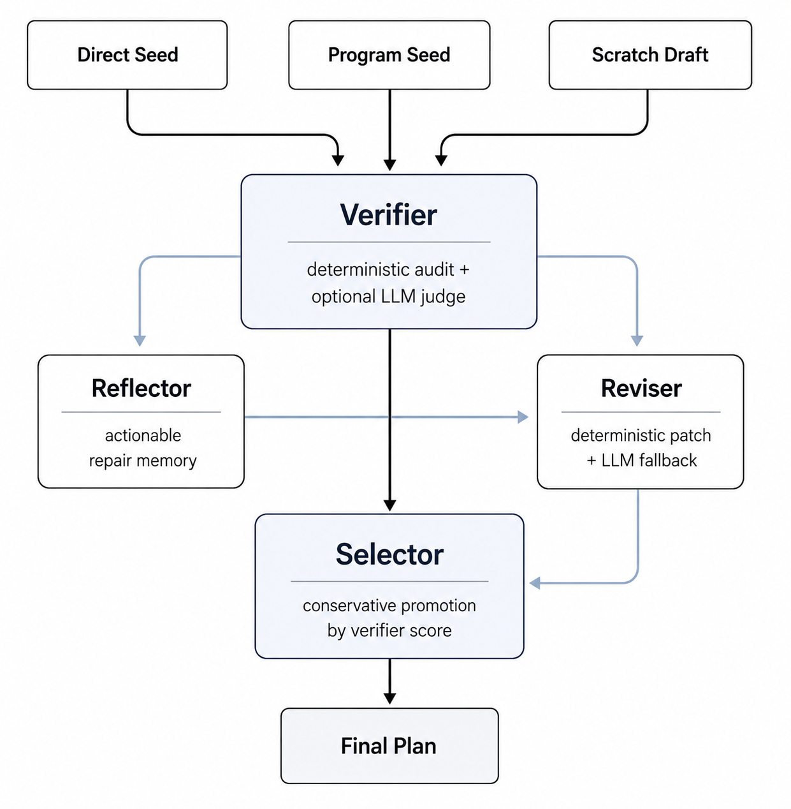

<div align="center">


# Constraint-Contract Multi-Agent Repair

**Reliable travel plans through explicit verification and conservative local repair.**

[](#quick-start) [](https://github.com/Eurus07e/constraint-guided-travel-planning/actions/workflows/tests.yml) [](paper/constraint_contract_multi_agent_repair.pdf) [](LICENSE)

[**Quick start**](#quick-start) &nbsp; · &nbsp; [**Results**](#results) &nbsp; · &nbsp; [**Reproduction**](#reproduction) &nbsp; · &nbsp; [**How it works**](#how-it-works) &nbsp; · &nbsp; [**Documentation**](#documentation)

<sub>A course research project · Introduction to Artificial Intelligence · Nanjing University</sub>

</div>

---

Language models can write convincing itineraries while quietly breaking constraints: a hotel requires too many nights, a restaurant sits in the wrong city, or the route exceeds the budget. **CC-MAR** makes these failures explicit and coordinates targeted repairs through specialist agents, a critic, and a deterministic mediator.

<table>
<tr>
<td width="33%" align="center">
<sub>BEST FINAL PASS</sub><br>
<strong>48.89%</strong><br>
<sub>Verifier-directed repair control</sub>
</td>
<td width="33%" align="center">
<sub>CC-MAR FINAL PASS</sub><br>
<strong>35.00%</strong><br>
<sub>Constraint-contract repair</sub>
</td>
<td width="33%" align="center">
<sub>CC-MAR HARD MACRO</sub><br>
<strong>72.22%</strong><br>
<sub>Highest among reported methods</sub>
</td>
</tr>
</table>

<p align="center"><sub>180 validation tasks · Local reproduction of the TravelPlanner evaluation protocol · Existing stored runs</sub></p>

## Results

The strongest verifier-directed repair control raises Final Pass from **20.00% to 48.89%**. CC-MAR achieves the highest Hard Macro score, while the narrower deterministic control remains strongest on end-to-end validity.

| Method | Final Pass ↑ | Commonsense Macro ↑ | Hard Macro ↑ |
| :--- | ---: | ---: | ---: |
| Direct Prompt | 20.00 | 20.56 | 57.22 |
| Generic Self-Refine | 12.22 | 13.33 | 51.67 |
| Verifier-Guided Hybrid Selector | 27.22 | 31.11 | 65.00 |
| **Verifier-Directed Repair Control** | **48.89** | **52.78** | 68.89 |
| Seeded Multi-Agent Planner | 46.67 | 49.44 | 67.22 |
| **CC-MAR** | 35.00 | 38.33 | **72.22** |

<sub>Values are percentages; higher is better. Final Pass is the primary end-to-end metric.</sub>

[Full results and ablations →](results/metrics_summary.csv) &nbsp; [Frozen predictions →](results/frozen/) &nbsp; [Replay checks →](results/replay_verification.json)

## Quick start

**Python 3.11 · Linux or macOS**

```bash
git clone https://github.com/Eurus07e/constraint-guided-travel-planning.git
cd constraint-guided-travel-planning

python3.11 -m venv .venv
source .venv/bin/activate
python -m pip install -r requirements-research.txt -c requirements-lock.txt
python -m pip check
```

Verify the installation and stored artifacts:

```bash
python -m unittest discover -s scripts -p 'test_*.py' -v
python -m scripts.verify_frozen
```

> [!TIP]
> Start here without an API key or benchmark download. The offline tests use simulated model responses; database-dependent tests are explicitly gated.

## Reproduction

**13 frozen submissions. 180 indexed tasks each.** The repository includes the predictions, expected outcomes and hashes needed to inspect existing results. Deterministic reconstruction matches all 180 historical repair plans and reproduces **88/180 Final Pass**.

After [preparing the official database](docs/reproduction.md#2-prepare-the-official-database):

```bash
python -m scripts.prepare_data

# Try three cases, then reconstruct the full validation submission.
python -m scripts.reproduce --limit 3 --output runs/demo.jsonl
python -m scripts.reproduce --output runs/reproduced_repair.jsonl

python -m scripts.evaluate_submission_subset --set-type validation \
  --input runs/reproduced_repair.jsonl --output runs/reproduced_metrics.json
```

| Configure | Environment variable |
| :--- | :--- |
| Use an existing benchmark database | `TP_DATABASE_DIR` |
| Select a different Direct seed submission | `DIRECT_SUBMISSION_FILE` |
| Select a different Program seed submission | `PROGRAM_SUBMISSION_FILE` |

The default seeds are the published historical Direct and Program predictions. `MODEL_NAME` controls new model calls; it does not change the origin of those seeds.

[Complete reproduction guide →](docs/reproduction.md)

## How it works

```text
Draft candidates → Audit constraints → Propose local repairs → Re-audit → Select
```

| Component | Responsibility |
| :--- | :--- |
| **Verifier** | Checks route closure, city alignment, database entities, transportation, accommodation rules, user constraints and estimated cost. |
| **Specialists** | Route, entity, lodging and budget agents propose field-level patches for diagnosed failures. |
| **Critic** | Reviews proposals for conflicts and possible regressions across constraints. |
| **Mediator** | Applies the audit again and accepts at most one strictly improving patch per round. |

<details>
<summary><strong>Explore the seeded planning and repair pipeline</strong></summary>

<p align="center">
  
</p>

The seeded pipeline ranks heterogeneous drafts, repairs diagnosed failures and conservatively promotes improvements. CC-MAR adds typed patches and role-specific responsibilities to local repair.

CC-MAR compares plans using a lexicographic violation vector:

```text
(fatal failures, invalid entities, invalid transport,
 minimum-night misses, local-constraint misses,
 budget failure, warnings, -audit score)
```

</details>

## Documentation

| I want to… | Start here |
| :--- | :--- |
| Reproduce an existing result | [Data setup and reconstruction](docs/reproduction.md) |
| Configure a runner or resume a failed case | [Configuration and recovery](docs/running.md) |
| Check installation and software behavior | [Validation commands](docs/validation.md) |
| Inspect the stored result artifacts | [Results directory](results/README.md) |
| Read the project report | [Paper PDF](paper/constraint_contract_multi_agent_repair.pdf) |

**Built for inspectable runs:** shared indexed evaluation, versioned audits, configuration fingerprints, atomic checkpoints, isolated request caches and per-request accounting.

Historical reconstruction uses `legacy-v1`; regular runs use `strict-v2`. The [audit checks](results/audit_comparison.json) cover the stored validation predictions. They are development-set checks, not held-out generalization evidence.

<details>
<summary><strong>Repository map</strong></summary>

```text
.
├── contract_multi_agent_repair.py   # CC-MAR and ablation switches
├── seeded_multi_agent_planner.py   # Seeded verifier-repair pipeline
├── strong_baseline_runner.py       # Direct and Self-Refine baselines
├── utils/plan_audit.py             # Deterministic constraint audit
├── evaluation/                    # Shared indexed evaluation
├── scripts/                       # Reproduction, analysis and tests
├── docs/                          # Setup, operation and validation
├── results/                       # Metrics and frozen predictions
├── paper/                         # Project report and LaTeX source
└── upstream/                      # Original benchmark attribution
```

</details>

## Scope

The reported comparisons are single stored runs on one validation split. They describe this benchmark setting, rather than a universal ranking of architectures. CC-MAR improves hard-constraint coverage, but its specialist decomposition is not reliably better than simpler repair policies.

A benchmark-valid itinerary is not real-world travel advice. Live availability, safety, visas, accessibility and disruptions are outside the benchmark.

## Attribution

An independent course research project by **Yuxuan Shu**, School of Intelligence Science and Technology, Nanjing University. This repository extends [OSU-NLP-Group/TravelPlanner](https://github.com/OSU-NLP-Group/TravelPlanner), introduced by Xie et al. at ICML 2024. It is a course artifact, not an official publication or a release by the TravelPlanner authors.

Original benchmark code and assets retain their MIT license. See [the upstream notice](upstream/NOTICE.md) and [repository license](LICENSE).

<details>
<summary><strong>Cite the original TravelPlanner benchmark</strong></summary>

```bibtex
@inproceedings{xie2024travelplanner,
  title     = {TravelPlanner: A Benchmark for Real-World Planning with Language Agents},
  author    = {Xie, Jian and Zhang, Kai and Chen, Jiangjie and Zhu, Tinghui and Lou, Renze and Tian, Yuandong and Xiao, Yanghua and Su, Yu},
  booktitle = {International Conference on Machine Learning},
  year      = {2024}
}
```

</details>

---

<p align="center">
  <sub>Yuxuan Shu · <a href="mailto:yuxuanshu@smail.nju.edu.cn">yuxuanshu@smail.nju.edu.cn</a></sub><br>
  <a href="#constraint-contract-multi-agent-repair">Back to top ↑</a>
</p>
